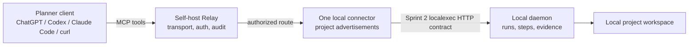

# MCP Gateway Model

Codencer exposes one project-aware MCP toolset through the self-host Relay. The public planner surface is the relay `/mcp` endpoint, not the local daemon and not separate ChatGPT, Claude, or Codex agents.

## Model

The connector advertises only projects that are explicitly shared from the local registry. Advertisements include machine/location metadata (`machine_id`, `host_label`, hostname, connector/instance ids, status). Relay stores sanitized project advertisements and routes tool calls back to the selected connector. Execution remains daemon-first and local.

If the same `project_id` is available from multiple online machines, Relay/MCP requires an explicit `machine_id` or `host_label` selector. Without one it returns structured blocker `ambiguous_project_location`; it does not randomly select a connector. Project listings expose `locations[]` with safe labels/hashes instead of absolute repo paths.

## Toolset

All planner clients use the same `codencer.*` MCP tools:

- `codencer.list_projects`
- `codencer.get_project`
- `codencer.submit_project_task_and_wait`
- `codencer.run_project_manifest`
- `codencer.get_execution_report`
- `codencer.get_run_report`
- `codencer.get_project_blocker`
- `codencer.get_blocker`

There is no ChatGPT-specific agent, Claude-specific agent, or Codex-specific planner inside Codencer. Client setup artifacts only teach those products how to reach the relay MCP endpoint.

## Relay Profiles

Relay profiles describe deployment posture, not different products:

- `local`: local daemon and local `codencer` CLI only.
- `self-host-relay`: operator-owned relay plus local connector.
- `oauth-dev`: self-host relay with the single-user OAuth dev issuer for ChatGPT testing.
- `future-gateway`: a managed/gateway posture that could proxy auth and routing while preserving the same project tool contract.

The useful analogy is Tailscale/Headscale: a private network endpoint can be self-hosted by the operator now, while a future hosted gateway could improve distribution and policy. That future boundary is transport/auth/ops monetization, not managed coding-agent execution or planner decision making.

## Safety Boundaries

- Project sharing is explicit; the connector does not expose arbitrary filesystem access.
- Relay is transport, auth, routing, and audit.
- The local daemon owns orchestration state and evidence.
- Codencer surfaces state and blockers; the planner decides.
- ChatGPT/Codex/Claude live product proof remains pending until those products actually connect and call tools with saved evidence.
