# MCP Gateway Model

Codencer exposes one project-aware MCP surface through self-host Codencer
Gateway. The public self-host default endpoint is:

```text
http://127.0.0.1:19090/mcp
```

Self-host Relay `/mcp` remains supported for advanced/direct/debug mode, but it
is not the primary public Gateway client endpoint.

## Model

```mermaid
flowchart LR
  Client["AI client\nChatGPT / Claude Code / Codex"]
  Gateway["Codencer Gateway\n/mcp, auth, workspace store, relay profiles"]
  Relay["Selected Relay\ndefault self-host or user-added"]
  Connector["Local connector\nproject advertisements"]
  Daemon["Local daemon\nruns, steps, evidence"]
  Repo["Local project workspace"]

  Client -->|Gateway MCP tools| Gateway
  Gateway -->|Relay profile + selectors| Relay
  Relay -->|authorized route| Connector
  Connector -->|local execution contract| Daemon
  Daemon --> Repo
```



Direct Relay MCP is still available:

```text
AI client -> user Relay /mcp
```

Use it for direct self-host debugging, not as the standard Gateway client path.

## Gateway Responsibilities

Gateway:

- authenticates AI clients with bearer-dev auth for self-host operation;
- exposes OAuth dev and protected-resource metadata for ChatGPT Developer Mode;
- stores users, personal workspaces, device login sessions, connector bindings,
  and Relay profiles in the Gateway persistent store;
- creates a default self-host Relay profile for each new workspace;
- lets users add self-host Relay profiles with `codencer gateway relay add`;
- aggregates projects across enabled Relay profiles;
- forwards approved project task/manifest calls to the selected Relay;
- normalizes Codencer results, blockers, and evidence;
- never returns backend Relay tokens to AI clients;
- sanitizes backend Relay responses so absolute local paths are not exposed.

Relay profiles contain:

- `id`
- `type` (`self_host`, with future/private builds free to add managed profiles)
- `url`
- `token_env` or a token file reference
- `enabled`

Literal Relay tokens are not returned to AI clients. In the current RC, Relay
token references are stored in the Gateway profile and resolved server-side
from env vars or token files.

## Official Toolset

Gateway exposes:

- `codencer.list_relays`
- `codencer.get_relay`
- `codencer.list_projects`
- `codencer.get_project`
- `codencer.list_project_locations`
- `codencer.submit_project_task_and_wait`
- `codencer.run_project_manifest`
- `codencer.get_run_report`
- `codencer.get_blocker`

The toolset is planner-neutral. There is no ChatGPT-specific agent,
Claude-specific agent, or Codex-specific planner inside Codencer.

## Routing Rules

Execution tools accept:

- `relay_profile_id`
- `machine_id`
- `host_label`

Routing is deterministic:

1. If `relay_profile_id` is provided, Gateway uses that Relay profile.
2. If no `relay_profile_id` is provided and only one enabled Relay profile has
   the project, Gateway uses it.
3. If multiple Relay profiles match and no selector is provided, Gateway returns
   blocker `ambiguous_relay_profile`.
4. If the selected Relay has multiple online project locations and no
   `machine_id` or `host_label` is provided, Gateway returns blocker
   `ambiguous_project_location`.
5. If a backend Relay is down, Gateway returns blocker `relay_unavailable`.
6. Gateway never chooses randomly.

Backend Relay blockers are forwarded in normalized Codencer blocker shape.

## Safety Boundaries

- Project sharing is explicit; the connector does not expose arbitrary
  filesystem access.
- Gateway owns official connector auth and Relay-profile routing.
- Relay remains transport, audit, and connector routing for its backend.
- The local daemon owns orchestration state and evidence.
- Codencer surfaces state and blockers; the planner decides.
- ChatGPT/Codex/Claude live product proof remains pending until those products
  actually connect to Gateway and call tools with saved evidence.

## Verification

Use:

```bash
make verify-official-connector
make verify-gateway
```

`make verify-official-connector` starts isolated temp Gateway, default official
Relay, self-host Relay, local daemon, connectors, and project on random free
ports. It checks `codencer login`, `codencer connector login`, Relay profile
add, MCP initialize/tools/list, `codencer.list_relays`,
`codencer.list_projects`, fake manifest execution through default and self-host
profiles, run report retrieval, ambiguity blockers, relay-down blocker, and no
obvious absolute path or token leakage.
